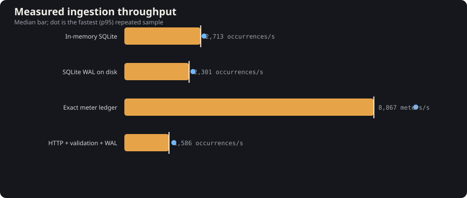
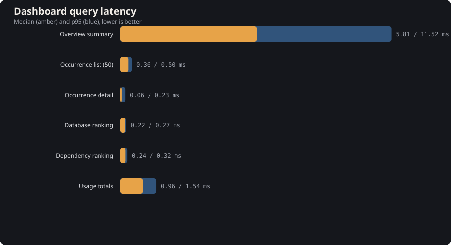

# Latest benchmark result

Generated 2026-09-12T07:01:23.759Z by `npm run benchmark`. This file, the JSON, dashboard data, and SVG charts are generated together.

## Environment

| Runtime | OS | CPU | Logical CPUs | Memory |
| --- | --- | --- | ---: | ---: |
| v24.18.0 | win32 10.0.26200 x64 | Intel(R) Core(TM) i5-10300H CPU @ 2.50GHz | 8 | 15.8 GiB |

## Throughput

| Path | Median | p95 sample | CV |
| --- | ---: | ---: | ---: |
| In-memory SQLite | 2,614 occurrences/s | 2,894 occurrences/s | 8.2% |
| SQLite WAL on disk | 1,615 occurrences/s | 1,953 occurrences/s | 10.6% |
| Exact meter ledger | 9,558 meters/s | 10,381 meters/s | 4.3% |
| HTTP + validation + WAL | 1,577 occurrences/s | 1,701 occurrences/s | 16.8% |



## Query latency

| Dashboard query | Median | p95 |
| --- | ---: | ---: |
| Overview summary | 6.721 ms | 9.821 ms |
| Occurrence list (50) | 0.387 ms | 1.895 ms |
| Occurrence detail | 0.116 ms | 0.249 ms |
| Database ranking | 0.218 ms | 0.272 ms |
| Dependency ranking | 0.240 ms | 0.529 ms |
| Usage totals | 1.007 ms | 1.879 ms |



## Storage

| Records | Database after checkpoint | Bytes / rich occurrence | JSON bytes / operation + meter |
| ---: | ---: | ---: | ---: |
| 10,000 | 33,460,224 B | 3,346.02 B | 1,535 B |

## Settings

```json
{
  "occurrences": 10000,
  "queryDataset": 25000,
  "iterations": 5,
  "queryIterations": 30,
  "warmupCount": 500,
  "batchSize": 100
}
```

Raw samples and full descriptive statistics: [latest.json](latest.json). Methodology and interpretation limits: [BENCHMARKS.md](../BENCHMARKS.md).
